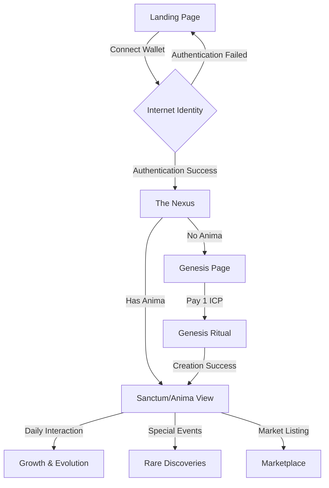

# Anima Flow Guide

## Core User Journey



## 🌟 Core Flow Steps

1. **Entry & Landing**
   - User arrives at landing page
   - Views core project information
   - Option to connect wallet

2. **Authentication**
   - Internet Identity integration
   - Secure wallet connection
   - Principal verification

3. **The Nexus (Hub)**
   - Central navigation hub
   - Anima status overview
   - Access to all features
   - Ancient Codex (Documentation)

4. **Genesis Path**
   - 1 ICP fee agreement
   - Name selection
   - Initial trait selection
   - Birth ceremony animation

5. **Sanctum/Anima View**
   - Daily interactions
   - Growth tracking
   - Trait evolution
   - Memory formation

6. **Growth & Evolution**
   - Experience accumulation
   - Trait development
   - New ability unlocks
   - Memory crystalization

## 🔮 Key Features By Stage

### 1. Pre-Genesis
- Project introduction
- Educational content
- Community links
- Market overview

### 2. Genesis
- Name creation
- ICP payment (1 ICP)
- Initial traits
- Birth animation
- First memory formation

### 3. Early Growth
- Basic interactions
- Core trait development
- Simple responses
- Memory accumulation

### 4. Advanced Evolution
- Complex interactions
- Rare trait discovery
- Deep memory patterns
- Special abilities

### 5. Mastery
- Cross-anima interactions
- Marketplace listing
- Legacy creation
- Wisdom sharing

## 🛠 Technical Integration Points

1. **Wallet Connection**
   ```typescript
   // Internet Identity integration
   const connectWallet = async () => {
     await internetIdentity.connect();
     if (authenticated) navigate('/nexus');
   };
   ```

2. **Genesis Transaction**
   ```typescript
   // ICP payment & anima creation
   const initiateGenesis = async () => {
     await processPayment(1_00000000); // 1 ICP in e8s
     const anima = await createAnima(name, traits);
     navigate(`/sanctum/${anima.id}`);
   };
   ```

3. **State Management**
   ```typescript
   // Core state updates
   const updateAnimaState = async () => {
     const state = await getAnimaState(id);
     updateTraits(state.traits);
     processMemories(state.memories);
   };
   ```

## 🎨 Theme & Style Guide

### Colors
- Primary: Amber/Gold (#FCD34D)
- Secondary: Deep Purple (#4C1D95)
- Accents: Orange/Fire (#EA580C)
- Text: Antique White (#FAF5FF)

### Typography
- Headings: Serif (mystical/ancient feel)
- Body: Clean sans-serif
- Accents: Runic/decorative for special elements

### Visual Elements
- Ancient symbols
- Sacred geometry
- Ethereal gradients
- Mystical particle effects